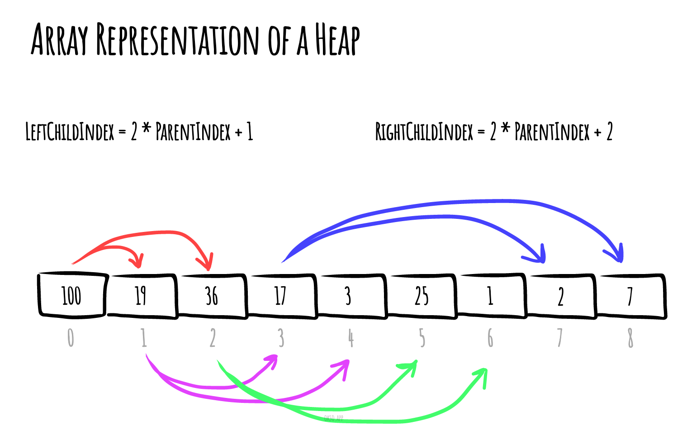

# Tas (structure de données)

En informatique, un **tas** est une structure de données arborescente spécialisée qui satisfait la propriété de tas décrite ci-dessous.

Dans un _tas minimal_ (en anglais _min heap_), si `P` est un nœud parent de `C`, alors la clé (la valeur) de `P` est inférieure ou égale à la clé de `C`.

_Made with [okso.app](https://okso.app)_

Dans un _tas maximal_ (en anglais _max heap_), la clé de `P` est supérieure ou égale à la clé de `C`.

Le nœud au «sommet» du tas sans parents est appelé le nœud racine.

## Références

- [Wikipedia](<https://fr.wikipedia.org/wiki/Tas_(informatique)>)
- [YouTube](https://www.youtube.com/watch?v=t0Cq6tVNRBA&index=5&t=0s&list=PLLXdhg_r2hKA7DPDsunoDZ-Z769jWn4R8)
